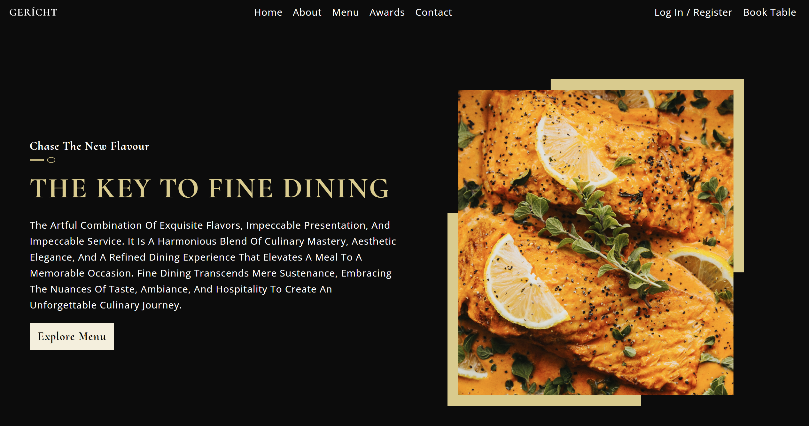
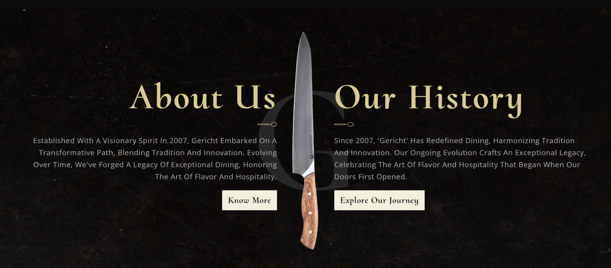
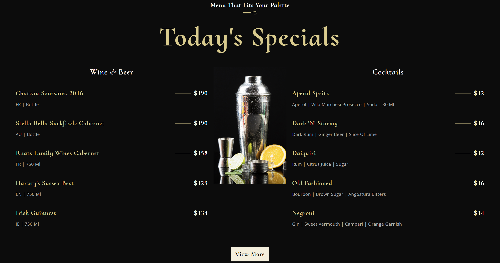
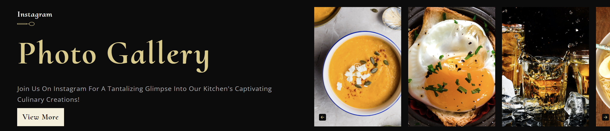
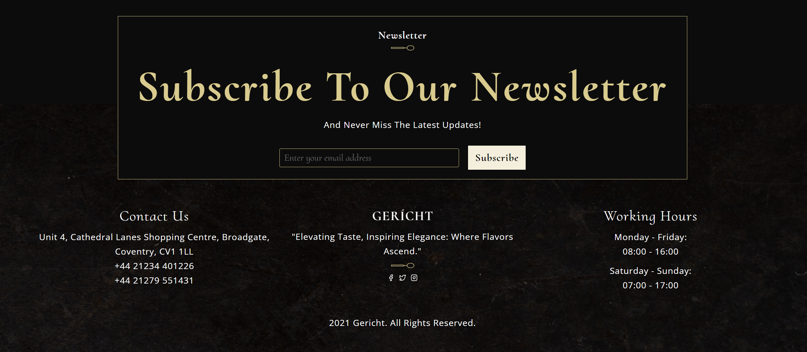

# ReactJS Restaurant Website

    
    
    
    
    
    
    
    

This program is to test the React framework and JavaScript language, building a basic restaurant website.

This has been built into a website accessible here: https://sommos.github.io/reactjs_restaurant_website/

# Contribution

If you'd like to contribute to `reactjs_restaurant_website` please submit a pull-request on a feature branch.

# Installing

Clone the repo:

    git clone https://github.com/Sommos/reactjs_restaurant_website
    cd reactjs_travel_website
